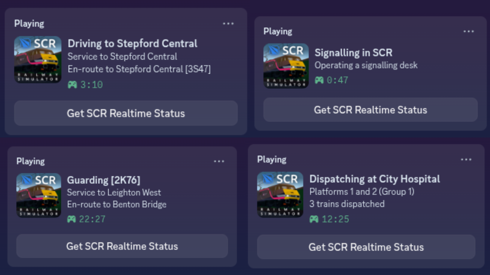

SCR Realtime Status is a simple program to show live updating SCR information inside of your status on discord.

It uses on a selenium webdriver to read your live activity from the SCR Website in real time. When first running the program you will be prompted to log in with roblox, This is required so that the program can automatically log into the SCR Website each time it is then run in the future. Use this project at your own risk.

## Features
- Destination, headcode and service status when driving
- Station and live statistics when dispatching
- Service information when guarding
- Limited information while signalling, Will be improved when the SCR website is updated with live signaller information.

## Examples



## Setup
Make sure you have the following installed:
- Python
- Git
- Google Chrome

Then run the following commands to install the project
```
git clone https://github.com/GENIUS12345AB/SCR-Realtime-Status.git
cd SCR-Realtime-Status
pip install -r requirements.txt
```
You can then run the program using
```
python main.py
```


Errors such as 

```
16:54:03 CRITICAL main.py Message: session not created: This version of ChromeDriver only supports Chrome version 144
Current browser version is 143.0.7499.192
```
Can be resolved by setting "driver_version" in config.json to the browser version provided by the error.

## To Do's
- Check for updates
- Alert potential version incompatiblity with hubsite
- Bug fixes caused by invalid session

[](https://github.com/qwertyquerty/pypresence)